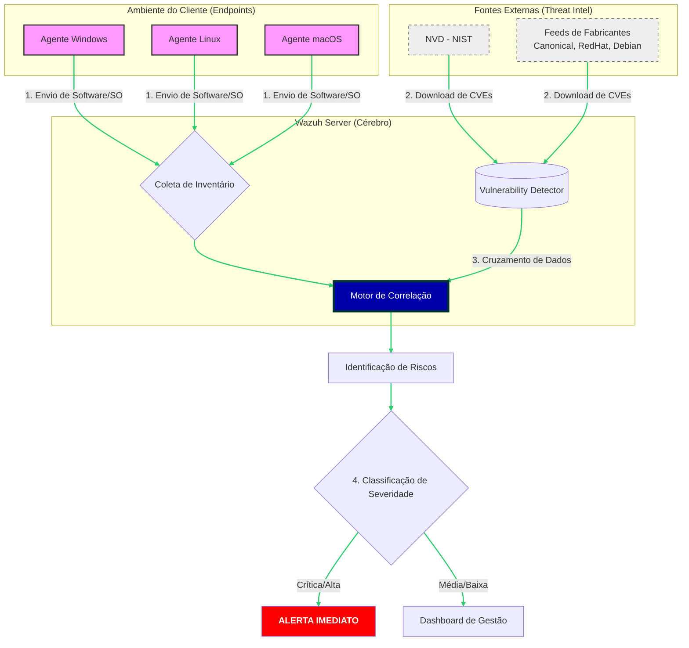

# Cyber Security Quick Guide
---
<b>1. Wazhu</b>

>O **Wazuh** é uma plataforma de segurança de código aberto (open source) que combina as funcionalidades:
>>**SIEM** (Gerenciamento de Eventos e Informações de Segurança) e 
>>
>>**XDR** (Detecção e Resposta Estendida). Ele é amplamente utilizado para monitorar infraestruturas em nuvem, on-premise e ambientes de contêineres.

<b>Resumo dos principais serviços e capacidades</b>

|Serviço ou Capacidade|Descrição|
|:--|:--|
|**1. Detecção e Resposta a Ameaças**|* **Análise de Logs:** Coleta, analisa e correlaciona logs de sistemas e aplicações em tempo real para identificar atividades suspeitas. * **Detecção de Intrusão (HIDS):** Monitora os endpoints (computadores, servidores) em busca de rootkits, malwares e anomalias no comportamento do sistema. * **Resposta Ativa (Active Response):** Executa ações automáticas quando uma ameaça é detectada, como bloquear um endereço IP no firewall ou encerrar um processo malicioso.|
| **2. Monitoramento de Integridade e Configuração**|* **Monitoramento de Integridade de Arquivos (FIM):** Detecta alterações em arquivos críticos, diretórios e chaves de registro, alertando sobre modificações não autorizadas. * **Avaliação de Configuração de Segurança (SCA):** Verifica se os sistemas seguem as melhores práticas de endurecimento (*hardening*) e políticas de segurança (como os benchmarks do CIS).|
|**3. Gestão de Vulnerabilidades e Ativos**|* **Detecção de Vulnerabilidades:** Cruza o inventário de software instalado nos agentes com bases de dados de vulnerabilidades conhecidas (CVE), identificando pontos fracos que precisam de correção. * **Inventário de Sistemas:** Coleta dados detalhados sobre o hardware e software dos dispositivos monitorados, facilitando a gestão de ativos.|
|**4. Segurança em Nuvem e Contêineres**|* **Monitoramento de Cloud:** Integra-se com provedores como AWS, Azure e Google Cloud para monitorar eventos de infraestrutura e atividades de usuários. * **Segurança de Contêineres:** Oferece visibilidade sobre hosts Docker e instâncias Kubernetes, detectando vulnerabilidades e comportamentos anômalos dentro dos contêineres.|
|**5. Conformidade Regulatória (Compliance)**|O Wazuh gera relatórios automáticos e dashboards específicos para ajudar empresas a atenderem requisitos de normas como: * **LGPD** (Brasil) * **GDPR** (Europa) * **PCI DSS** (Cartões de pagamento) * **HIPAA** (Saúde) * **SOC2**

<b>Arquitetura Simplificada</b>
Para oferecer os serviços, o Wazuh utiliza três componentes principais

|Componentes|Descrição|
|:--|:--|
|1.  **Agente Wazuh:**| Instalado nos dispositivos monitorados para coletar dados.|
|2.  **Servidor Wazuh:**| Analisa os dados recebidos e aciona alertas.|
|3.  **Wazuh Dashboard:**| Interface visual para análise de dados e gerenciamento da plataforma.|

<b>Detecção de Vulnerabilidades (Vulnerability Detector)</b>

O Wazuh não apenas avisa que algo está errado; ele atua como um scanner contínuo. Diferente de ferramentas que rodam uma vez por semana, o Wazuh mantém um inventário atualizado.

<b>Como funciona o fluxo de detecção de vulnerabilidades</b>

---
<b>Wazuh e a LGPD</b>

A LGPD exige que as empresas adotem "medidas de segurança, técnicas e administrativas aptas a proteger os dados pessoais". O Wazuh ajuda diretamente nos seguintes pilares da lei:

* **Prevenção (Art. 6º):** Ao detectar vulnerabilidades antes que sejam exploradas, você está prevenindo acessos não autorizados a dados pessoais.
* **Segurança e Confidencialidade (Art. 46º):** O monitoramento de integridade de arquivos (FIM) avisa se alguém alterou uma base de dados ou um arquivo de configuração sensível.
* **Notificação de Incidentes (Art. 48º):** Se ocorrer uma invasão, o Wazuh fornece os logs e a linha do tempo exata do que aconteceu, facilitando o relatório que deve ser enviado à ANPD (Autoridade Nacional de Proteção de Dados).

### O Painel de Conformidade
O Wazuh possui um dashboard específico onde você filtra os eventos de segurança pelos artigos da LGPD. Se um usuário tenta acessar uma pasta de RH sem permissão, o Wazuh gera um alerta que já vem "tagueado" como uma possível violação de política de privacidade.

---

## Próximos Passos Práticos

Para começar a usar esses recursos, o caminho geralmente é:

1.  **Habilitar o Módulo:** No arquivo de configuração do servidor (`ossec.conf`), você precisa ativar o `<vulnerability-detector>`.
2.  **Configurar Alertas:** Definir que vulnerabilidades "Críticas" enviem um e-mail ou Slack/Teams imediato para sua equipe.
3.  **Auditoria de Acesso:** Configurar o monitoramento de diretórios onde ficam armazenados dados pessoais (como `/var/lib/mysql` ou pastas de documentos de clientes).

**Gostaria que eu te mostrasse o trecho de código/configuração para ativar o detector de vulnerabilidades no servidor?**

-----------

Aqui está o detalhamento técnico:

---

## 1. Detecção e Resposta a Ameaças
Este é o núcleo reativo e proativo da ferramenta.
* **Análise de Logs:** O agente utiliza seletores (decoders) para transformar logs brutos em dados estruturados. O servidor então aplica **regras XML** para identificar padrões. Se um log de "falha de login" ocorre 10 vezes em 1 minuto vindo do mesmo IP, o Wazuh eleva o nível do alerta.
* **HIDS (Detecção de Intrusão):** Foca em anomalias de sistema. Ele procura por **rootkits** ocultos comparando as chamadas de sistema diretas com o que o SO reporta. Se houver discrepância, há uma intrusão.
* **Resposta Ativa:** É um sistema baseado em gatilhos. Você configura: "Se o alerta X (nível > 10) ocorrer, execute o script Y". Isso permite isolar um host da rede automaticamente ao detectar um ransomware.

## 2. Monitoramento de Integridade e Configuração
Focado na "linha de base" (baseline) de segurança do servidor.
* **FIM (File Integrity Monitoring):** O Wazuh cria um banco de dados de *hashes* (assinaturas digitais) de arquivos críticos (como o `System32` no Windows ou `/etc` no Linux). Se um bit mudar, o hash muda, e o Wazuh identifica quem mudou, quando e qual conteúdo foi alterado (diff).
* **SCA (Security Configuration Assessment):** O motor de SCA executa varreduras de políticas. Ele verifica, por exemplo, se o acesso root via SSH está desabilitado ou se as senhas possuem complexidade mínima, pontuando o servidor de 0 a 100 em conformidade.

## 3. Gestão de Vulnerabilidades e Ativos
Transforma o monitoramento em gestão de riscos.
* **Detecção de Vulnerabilidades:** Como vimos, ele usa o **Vulnerability Detector**. O diferencial é que ele é *agentless-based* para a análise: o agente apenas envia a lista de pacotes, e o servidor faz o trabalho pesado de cruzamento com o banco de dados de CVEs, evitando consumo de CPU no endpoint.
* **Inventário de Sistemas (Syscollector):** Coleta informações de rede (portas abertas, interfaces), processos em execução e hardware. É essencial para descobrir "Shadow IT" (softwares não autorizados instalados por usuários).

## 4. Segurança em Nuvem e Contêineres
Expande o perímetro para infraestruturas modernas.
* **Cloud (AWS/Azure/GCP):** O Wazuh se conecta via APIs (como o AWS CloudTrail) para monitorar mudanças na infraestrutura, como a criação de um bucket S3 público ou alteração de grupos de segurança (firewall da nuvem).
* **Contêineres:** Ele monitora o *runtime* do Docker. Consegue ler logs de dentro dos contêineres e verificar se as imagens utilizadas possuem vulnerabilidades conhecidas antes mesmo de irem para produção.

## 5. Conformidade Regulatória (Compliance)
A camada de governança e auditoria.
* **Mapeamento de Controles:** O Wazuh possui um sistema de "tags" nas regras. Uma regra de "acesso negado" possui as tags `gdpr_IV_32.2` e `lgpd_art_46`.
* **Dashboards Dedicados:** Ao abrir o painel da LGPD, o Wazuh filtra todos os eventos de segurança que impactam a privacidade de dados, facilitando a geração de evidências para auditorias ou para o DPO (Encarregado de Dados).

---

### Tabela de Resumo Operacional

| Serviço | Frequência | Impacto no Endpoint | Principal Benefício |
| :--- | :--- | :--- | :--- |
| **Análise de Logs** | Tempo Real | Mínimo | Visibilidade total de eventos |
| **FIM (Integridade)** | Agendado/Real | Médio | Detectar invasores silenciosos |
| **Vulnerabilidades** | Periódico | Baixo | Antecipação de ataques |
| **SCA (Hardening)** | Diário | Baixo | Redução da superfície de ataque |
