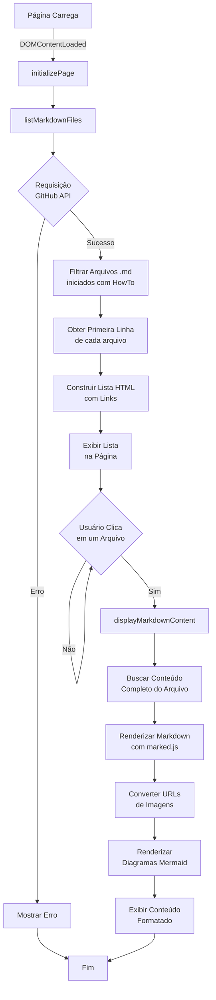
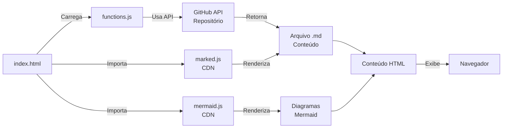
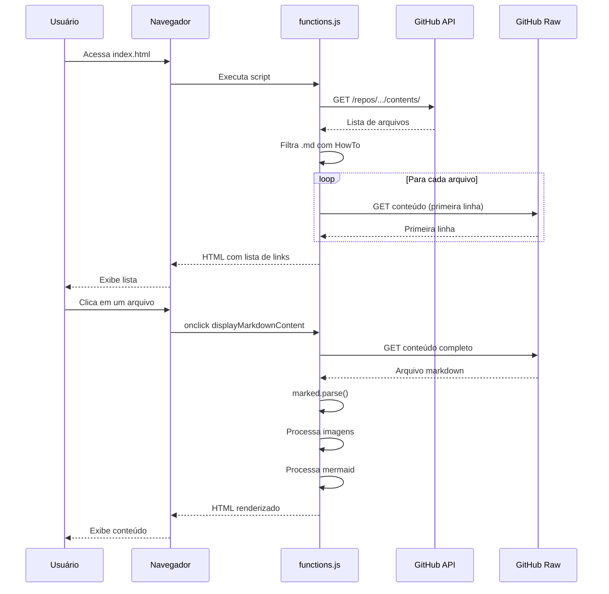
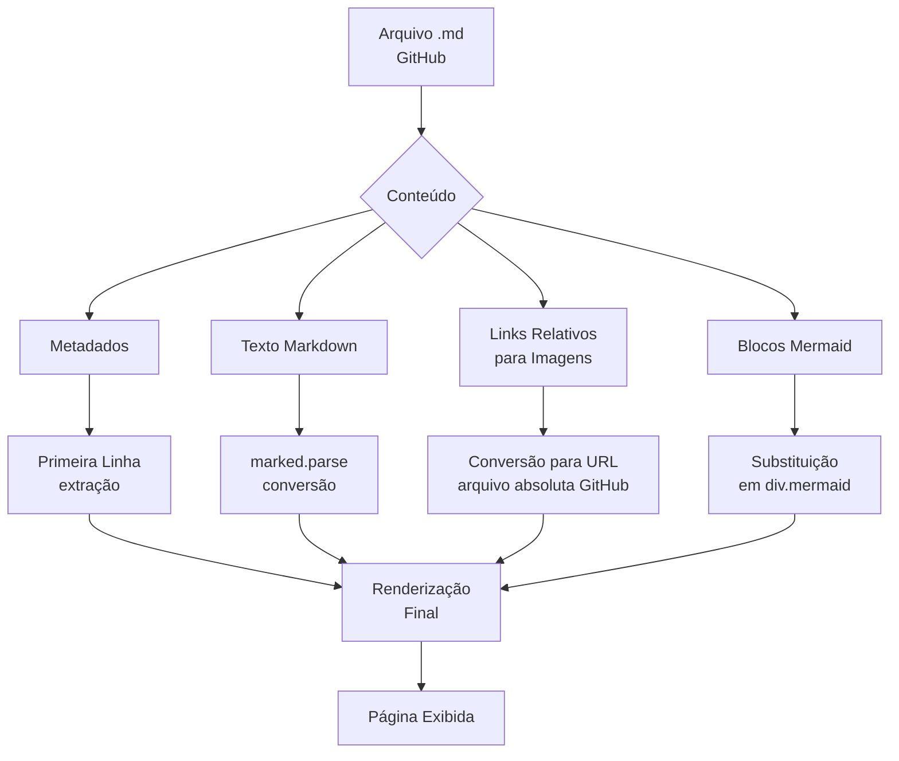
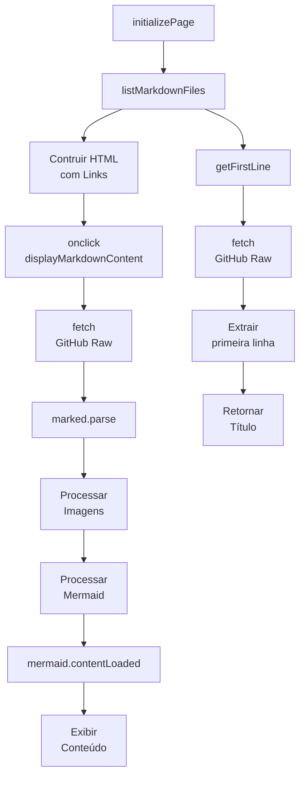
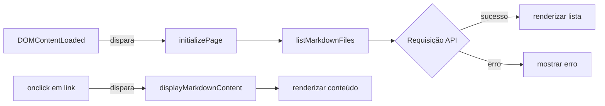
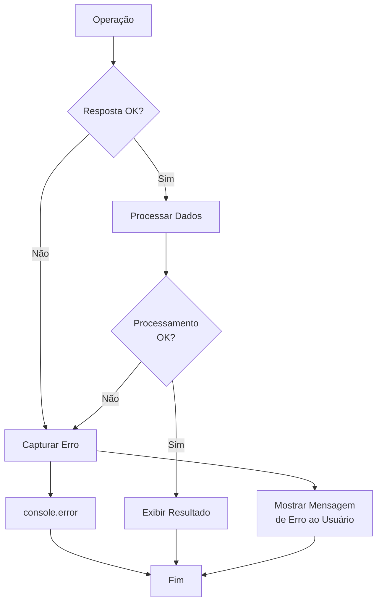
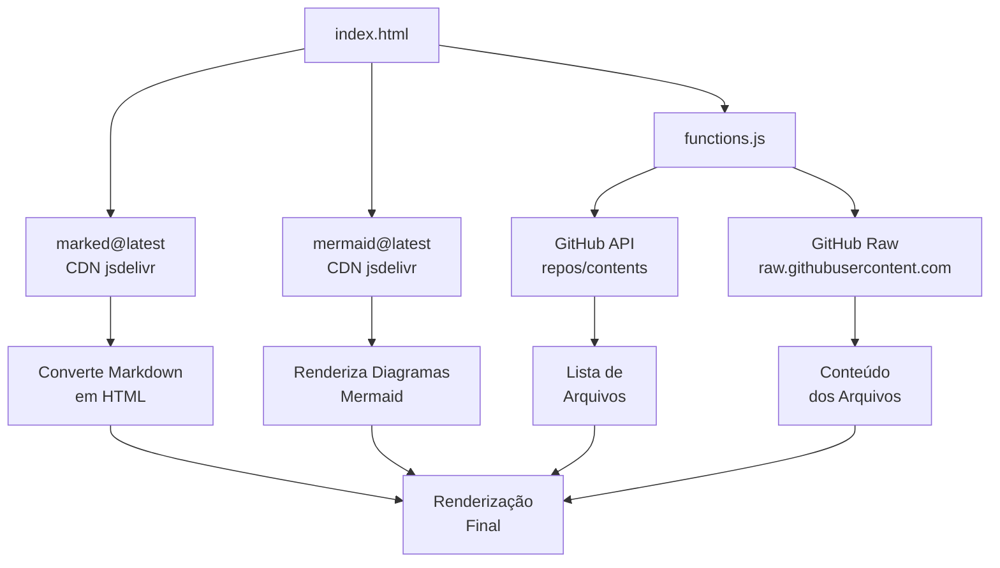
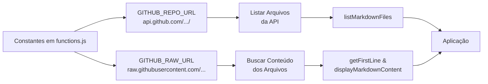

# Diagrama da Aplicação HowTo

## 1. Fluxo Geral da Aplicação

## 2. Arquitetura de Componentes

## 3. Fluxo de Carregamento de Arquivos

## 4. Estrutura de Dados - Arquivo Markdown

## 5. Estrutura das Funções Principais

## 6. Mapa de Eventos

## 7. Fluxo de Tratamento de Erros

## 8. Dependências Externas

## 9. Configurações e Constantes

## Resumo da Lógica

A aplicação funciona como um **navegador web de arquivos markdown** hospedados no GitHub:

1. **Inicialização**: Quando a página carrega, invoca `initializePage()` que chama `listMarkdownFiles()`
2. **Listagem**: Consulta a API do GitHub para obter a lista de arquivos `.md` que começam com "HowTo"
3. **Títulos**: Para cada arquivo, extrai a primeira linha como título usando `getFirstLine()`
4. **Interface**: Cria uma lista HTML com links clicáveis para cada arquivo
5. **Visualização**: Quando o usuário clica em um arquivo:
   - Busca o conteúdo completo via GitHub Raw URL
   - Renderiza o markdown usando a biblioteca `marked.js`
   - Converte URLs relativas de imagens em URLs absolutas do GitHub
   - Processa blocos de código `mermaid` como diagramas
   - Renderiza os diagramas usando `mermaid.js`

**Fluxo de Dados**: GitHub → API/Raw URLs → HTML → Browser → Usuário

**Tecnologias**: Vanilla JavaScript, Marked.js, Mermaid.js, GitHub API
