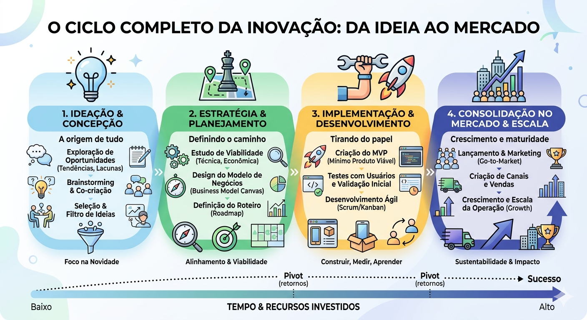
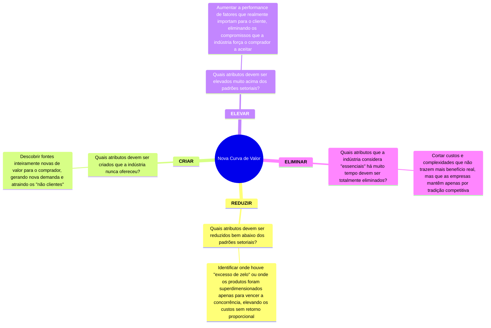
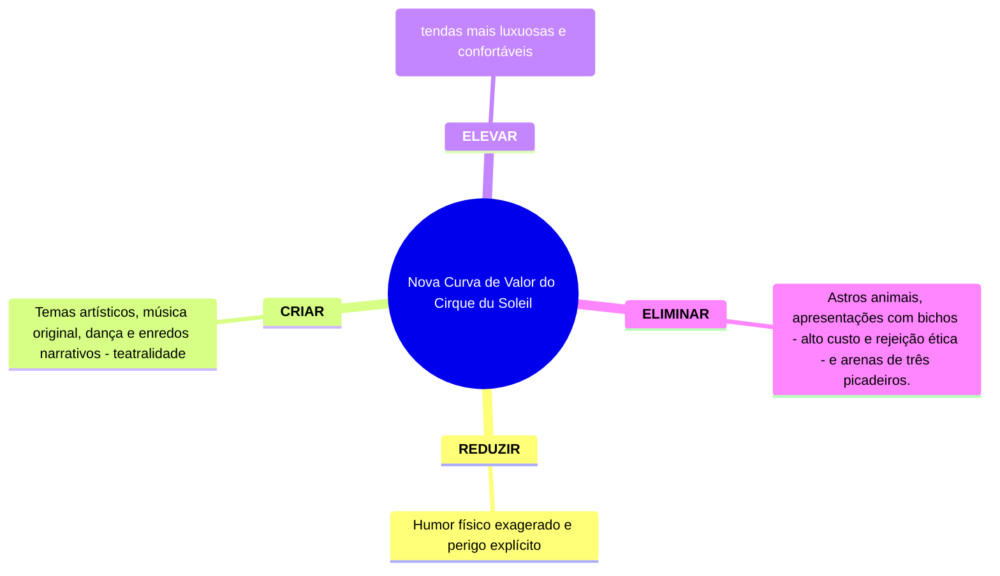
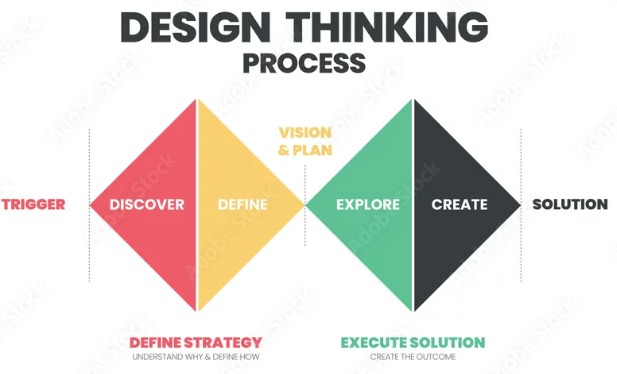
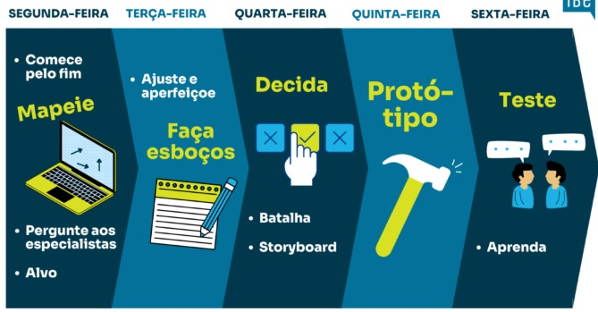
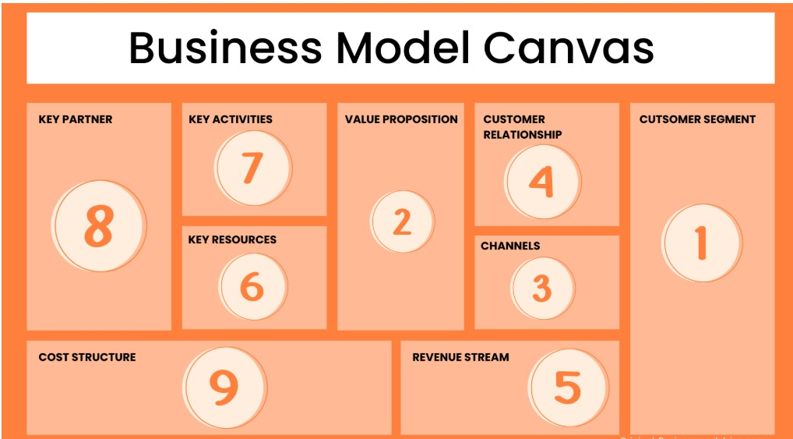

# Inovação Quick Guide

>**Assuntos abordados nesse Quick Guide**
>>1. Conceituando Inovação
>>2. Ciclo Completo da Inovação
>>3. Ferramentas e Modelos usadas no processo de inovação
>>4. Em 2026, quais são as diretrizes para conduzir inovação nas empresas
-----

<b>1. Conceituando Inovação</b>

> |Referência|Base|Definição|Conceito|
> |:--|:--|:--|:--|
> |**Destruição Criativa** Schumpeter|Inovação não é apenas uma ideia nova, mas a implementação dessa ideia no mercado|Introdução de um novo bem, um novo método de produção, a abertura de um novo mercado, a conquista de uma nova fonte de matérias-primas ou a reorganização de qualquer indústria|O novo substitui o velho, impulsionando o desenvolvimento econômico Separar claramente a invenção (o ato de criar algo novo) da inovação (o ato de colocar isso no mercado com sucesso)|
>|**Inovação Disruptiva** Christensen|Visão focada na estratégia competitiva|Transformação de um produto caro e complicado em algo muito mais acessível e simples, permitindo que uma população maior de pessoas tenha acesso a ele|Geralmente começa atendendo a um público negligenciado pelas grandes empresas (o "baixo mercado") e, com o tempo, evolui até desbancar os líderes estabelecidos|
>|**Inovação como Disciplina** Drucker|Ferramenta específica dos empreendedores|"O ato de dotar os recursos de uma nova capacidade de criar riqueza."|Trabalho sistemático que consiste em explorar mudanças (sejam elas sociais, demográficas ou técnicas) como oportunidades|
>|**Manual de Oslo (OCDE)**|padrão internacional para conceituar inovação em termos estatísticos e de políticas públicas|"Um produto ou processo novo ou aprimorado (ou uma combinação dos dois) que difere significativamente dos produtos ou processos anteriores da unidade e que foi disponibilizado aos usuários potenciais (produto) ou colocado em uso pela unidade (processo)."|**<U>As 4 Categorias Tradicionais</U>** 1. **Inovação de Produto:** Mudanças nas características de bens ou serviços. 2. **Inovação de Processo:** Mudanças nos métodos de produção ou logística. 3. **Inovação de Marketing:** Mudanças no design, embalagem ou precificação. 4. **Inovação Organizacional:** Mudanças nas práticas de negócio ou na organização do local de trabalho.

#### A Equação da Inovação
> **Inovação = Invenção x Comercialização**
>> Sem o fator da "comercialização" (ou adoção pelo usuário), você tem apenas uma ideia ou um protótipo, não uma inovação.

---
<b>2. Ciclo Completo da Inovação</b>

<figure align="center">
  
</figure>

---
<b>3. Ferramentas e Modelos usadas no processo de inovação</b>

<b><u>Estratégia do Oceano Azul</u></b>
---

| Oceano Vermelho | Oceano Azul |
| :-- | :-- |
| Defender a posição atual | Inovar e perseguir novas oportunidades |
| Mercados Existentes | Novos mercados |
| Vencer a Concorrência | Concorrência irrelevante |
| Demanda existente |  Novas demandas |
| Trade-off Valor x Custo | Quebrar trade-off Valor x Custo |
| Preço ou diferenciação | Preço e Diferenciação |
|| <b>Oceano Azul consiste em</b> Reduzir/Eliminar <b>CUSTO</b> e  Elevar/Criar <b>VALOR PARA O CLIENTE</b>,  criando um cenário em que possa oferecer <b>preços mais acessíveis e diferenciação</b> ao cliente e obter <b>maior retorno</b>|

 

 

#### Exemplo das ações ERRC (Eliminar-Reduzir-Elevar-Criar): Cirque du Soleil

 

>**A Curva de Valor**
>>Ao aplicar essas ações, a empresa não apenas reduz custos (***Eliminar/Reduzir***), mas também aumenta a percepção de valor (***Elevar/Criar***). Isso é o que os autores chamam de Inovação de Valor.

 

<b><u>Design Thinking</u></b>

> 1. Estética
> 2. Usabilidade
> 3. Atender uma necessidade real
---

<figure align="center">
  
  <figcaption>Figura 1: Representação visual do Processo do Design Thinking.</figcaption>
  <figcaption>É um processo não-linear.</figcaption>
</figure>

  
 
>#### Premissas
>1. Mergulho na necessidade do usuário
>2. Desejabilidade
>3. Viabilidade
>4. Possibilidade

 

<b><u>Design Sprint</u></b>
> Metodologia estruturada passo a passo para resolver problemas complexos e <b><u>focados</u></b>, com uma pequena equipe, no prazo de uma semana.
>> Essa metodologia utiliza, assim como no SCRUM, o conceito de <b><u>SPRINT</u></b> que podemos conceituar como sendo um <b><u>esforço focado e direcionado num curto espaço de tempo</u></b>.

<figure align="center">
  
  <figcaption>Figura 1: Representação visual do Processo do Design Sprint.</figcaption>
</figure>

 

<b><u>Business Model Canvas</u></b>

<figure align="center">
  
  <figcaption>Figura 1: Representação visual do Business Model Canvas.</figcaption>
</figure>

 

| BLOCO | DESCRIÇÃO |
| :-- | :-- |
|**1. Segmentos de Clientes**|Quem são as pessoas que você quer atender?|
|**2. Proposta de Valor**|Que valor você oferece para resolver os problemas delas?|
|**3. Canais**|Como você se comunica e entrega seu valor?|
|**4. Relacionamento com Clientes**|Que tipo de relação você constrói com cada segmento?|
|**5. Fontes de Receita**|Como você ganha dinheiro com a entrega de valor?|
|**6. Recursos-Chave**|Quais recursos são essenciais para o seu negócio funcionar?|
|**7. Atividades-Chave**|Quais são as tarefas mais importantes que você precisa realizar?|
|**8. Parcerias-Chave**|Com quem você pode fazer parcerias para otimizar seu negócio?|
|**9. Estrutura de Custos**|Quais são os custos mais importantes do seu negócio?|

---
<b>4. Em 2026, quais são as diretrizes para conduzir inovação nas empresas</b>

<b><u>Insights</u></b>
1. Empresas de alto nível (como as do ranking Fortune 500 e as grandes techs) pararam de tratar a inovação como um evento isolado e passaram a geri-la como um sistema de portfólio.
2. O foco atual não é apenas "ter ideias", mas sim velocidade de experimentação e integração de IA na estratégia.

<b><u>Modelos Estratégicos</u></b>
>O objetivo é garantir que a inovação não seja apenas incremental, mas disruptiva

|MODELO|DESCRIÇÃO|
|:--|:--|
|**1. Ambidestria Organizacional**| O modelo mais comum.   A empresa divide seus esforços em "Explorar" (buscar novos mercados e tecnologias) e "Explorar" (otimizar o negócio atual).|
|**2. Matriz de Ambição de Inovação**| Define o investimento em três níveis: Core (otimização), Adjacente (expansão) e Transformacional (novos mercados).|
|**3. Inovação de Valor (Oceano Azul)**|continua sendo o pilar para empresas que buscam criar novos mercados em vez de apenas competir por preço.|
|**Design Sprint 3.0**|Uma evolução do método do Google, agora fortemente assistido por IA generativa para prototipar soluções em apenas 2 ou 3 dias.|

<b><u>AI Agents: A "Nova Mão de Obra" de Inovação</u></b>
>Em 2026, a maior mudança foi a adoção de Agentes Autônomos de IA.

|FUNÇÃO|DESCRIÇÃO|
|:--|:--|
|**Mapear Patentes**|Identificar brechas tecnológicas em milissegundos.|
|**Análise de Sentimento em Tempo Real**|Ajustar produtos com base no feedback imediato das redes sociais.|
|**Scouting de Startups**|Identificar parceiros ideais para inovação aberta antes mesmo da concorrência.|

<b><u>Gestão de Portfólio (A "Mente" do Negócio)</u></b>

1. Empresas de alto nível tratam projetos de inovação como ativos financeiros.
2. Se um projeto não atinge os marcos (milestones) definidos em 3 meses, ele é "matado" rapidamente (Kill Gates) para liberar orçamento para o próximo.

<b><u>Insight de 2026</u></b>
>A inovação hoje é menos sobre "criatividade genial" e mais sobre rigor de dados e automação de processos repetitivos.