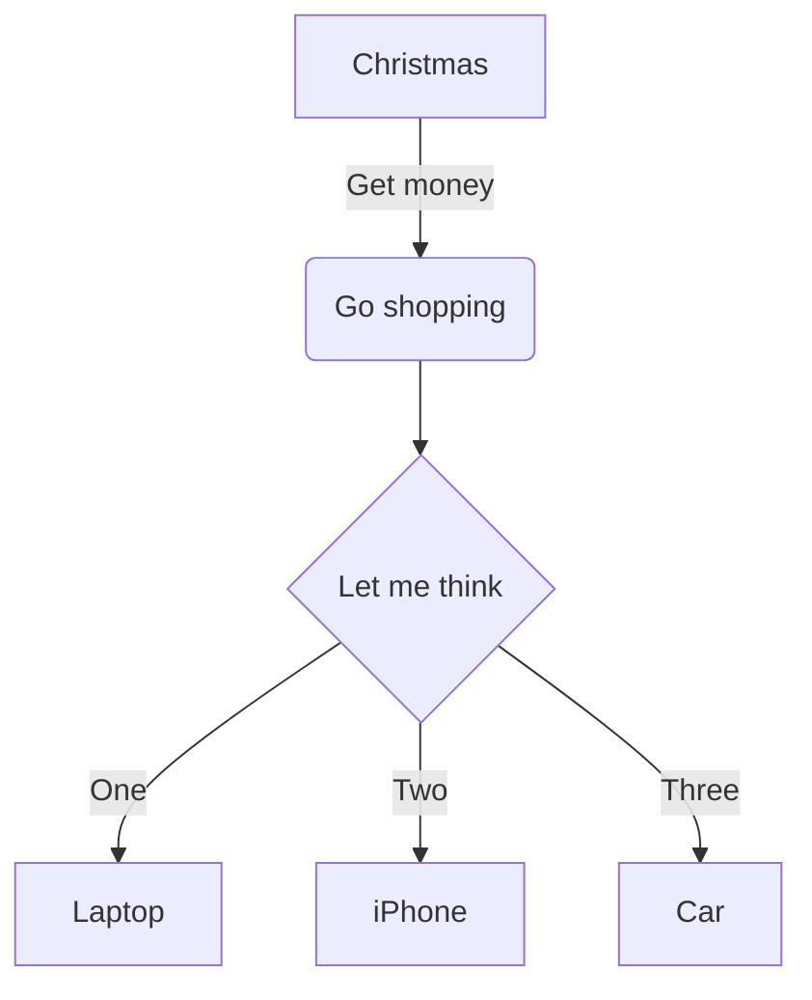
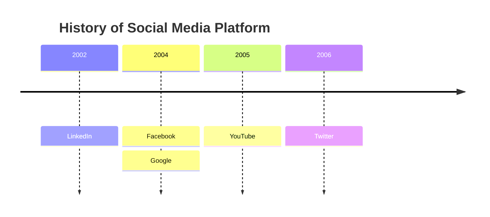
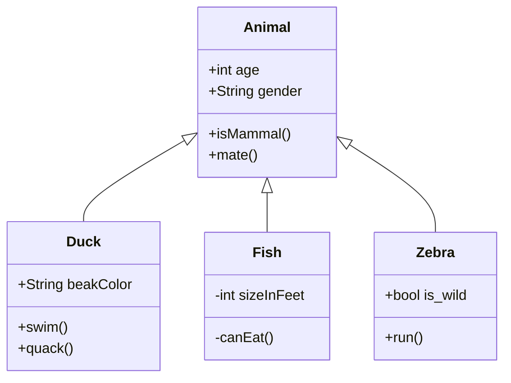
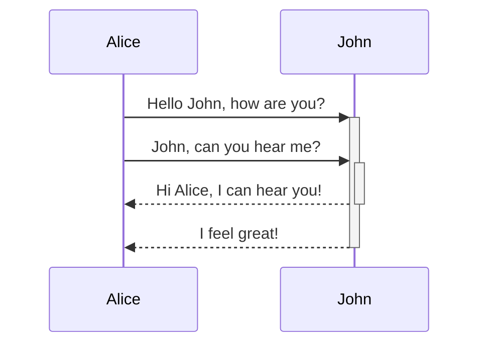
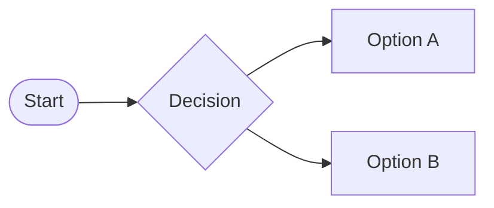
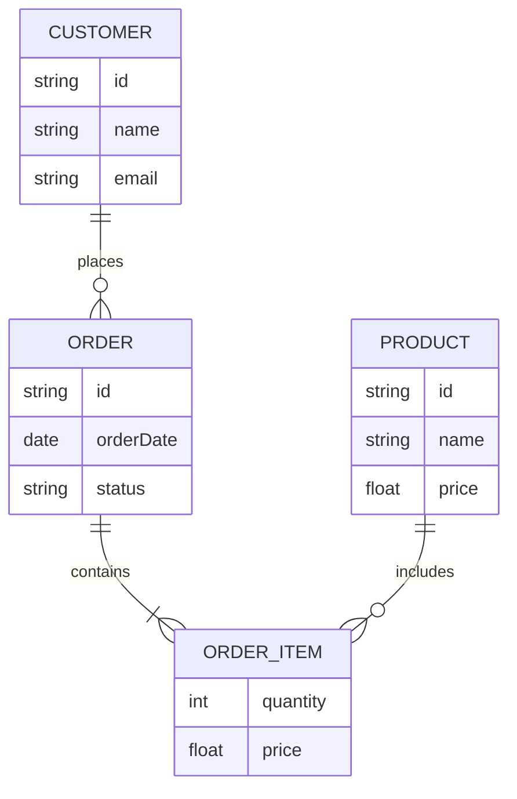
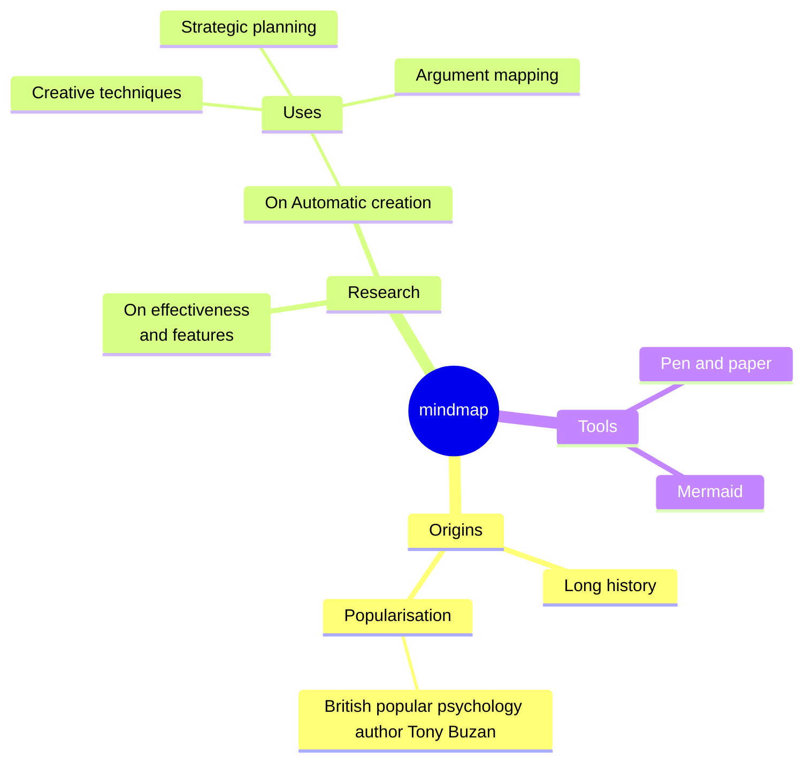
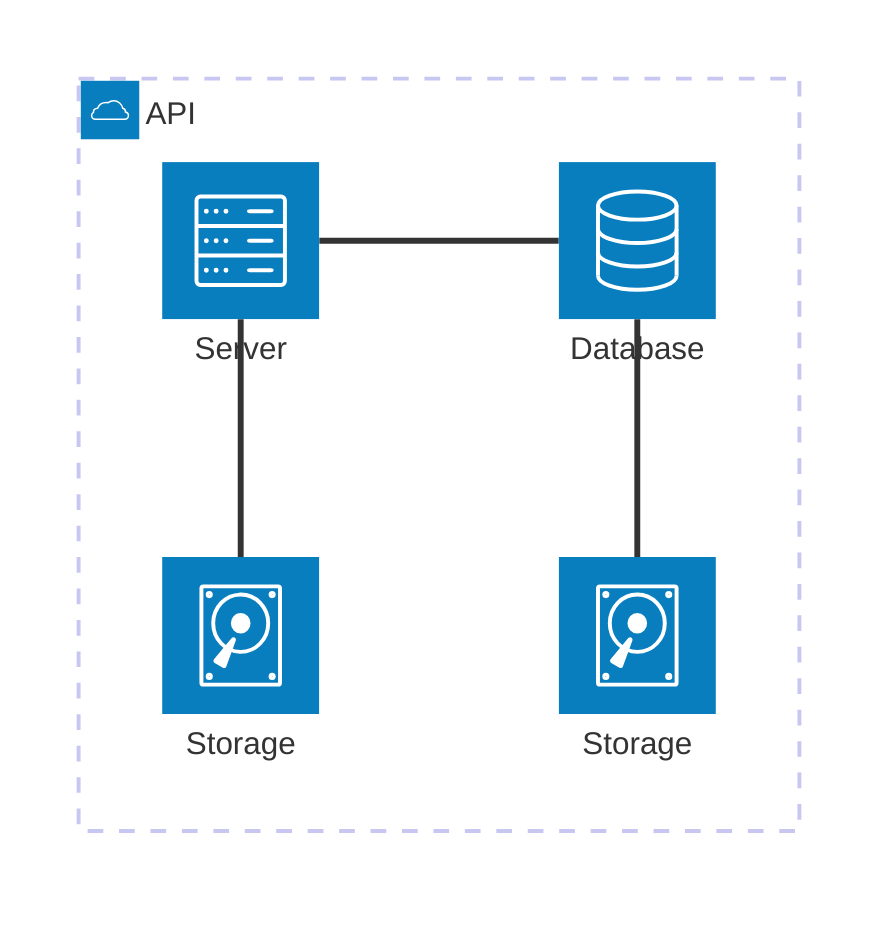

# markdowndiagramas
[Mermaid Page](https://mermaid.js.org/#/)
 
[Mermaid Sample Diagrams](https://mermaid.live/edit#pako:eNpVkT1PwzAQhv-KdRNIaRWn-Wg9INEUuhTBwETSwWqusdXGjhxHpST57zipEHCTT-_zvB6ug4MuEBgcz_pyENxY8r7JFXHzmKXCyMZWvNmT2eyh36IllVZ47cn6bqtJI3RdS1Xe3_j1CJG0240YEiukOg23KJ38V4U92WQ7Xltd7_8m7xfdk6dMvglX_z8RBp31nB05O_LZgRuScrMHD0ojC2DWtOhBhabi4wrdKOdgBVaYA3PPgptTDrkanFNz9aF19aMZ3ZYCXO-5cVtbF9ziRvLS8F8EVYEm1a2ywAKaTB3AOvgEtoiDOaXhivqULpfxYhF5cAUWruZRHIRJGMZJHK0COnjwNf3qz5dJ5LsJYj9J_MDxWEirzcvtBtMphm85xHsb)

---
##### Tabela com os tipos de setas de direcionamento suportados atualmente

| *Type* | *Description* |
| :---: | :---|
| -> | Solid line without arrow |
| --> | Dotted line without arrow |
| ->> | Solid line with arrowhead |
| -->> | Dotted line with arrowhead |
| -x | Solid line with a cross at the end |
| --x | Dotted line with a cross at the end |
| -) | Solid line with an open arrow at the ende (async) |
| --) | Dotted line with a open arrow at the ende (async) |

---
##### Flowchart

---
##### TimeLine

---
##### Class

---
##### Sequence

---
##### Diagrama com decisão

---
##### ExR

---
##### MindMap

---
##### Architecture

