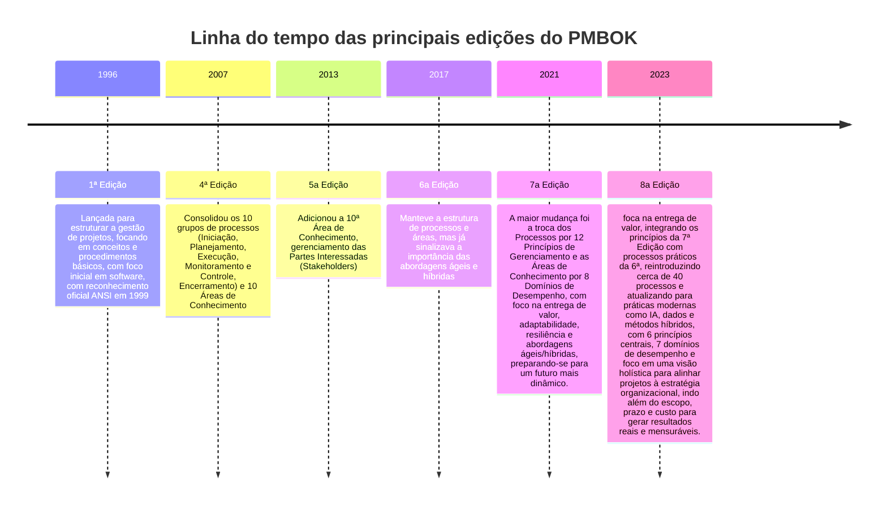

# PMBOK (Project Management Body of Knowledge)

Guia de melhores práticas, conceitos, processos, ferramentas e técnicas padronizadas para gerenciar projetos, publicado pelo PMI (Project Management Institute), servindo como uma referência mundial para gestores de projetos de qualquer área, independentemente da metodologia (Cascata, Híbrida, Ágil). 

<!-- ======================================
     Sessão com a linha do tempo das
     principais edições do PMBOK
=========================================== -->
---

----
|Característica|PMBOK 6|PMBOK 7|PMBOK 8|
|:--|:--|:--|:--|
|**Abordagem Principal**|Prescritiva: "Como fazer" (Processos)|Baseada em Princípios: "Por que fazer" (Mentalidade)|Integradora: Equilíbrio entre Mindset (Por que) e Execução (Como)|
|**Estrutura Central**|Áreas de Conhecimento[(?)](#NotaPMBOK610areasconhecimentoPMBOK6)|12 Princípios e 8 Domínios de Desempenho|6 Princípios Consolidados e 7 Domínios de Desempenho|
|**Organização do Trabalho**|5 Grupos de Processos[(?)](#NotaPMBOK6gruposeprocessos)|Foco em Entrega de Valor e Sistema de Entrega|Reintroduz Grupos de Processos como "Áreas de Foco"|
|**Processos e ITTOs**[(?)](#NotaITTOs)|49 processos detalhados com Entradas, Ferramentas e Saídas[(?)](#NotaPMBOK6gruposeprocessos)|Removidos do guia físico (migrados para o PMIstandards+)|Reintroduz cerca de 40 processos simplificados e orientações práticas|
|**Foco de Entrega**|Entregas do projeto (escopo/produtos)|Resultados e Valor para o negócio|Valor contínuo, Sustentabilidade e IA|
|**Papel do Gerente**|Controlador de processos e cronogramas|Facilitador|Líder estratégico, facilitador de IA e agente de valor|
|**Temas Emergentes**|Menção tímida ao Ágil|Foco total em Híbrido e Ágil|IA Generativa, Governança de Dados e Sustentabilidade (ESG)|
---

> #### **ITTOs**
>> **I**nputs
>> **T**ools
>> **T**echniques
>> **O**utputs
>>>[Retornar](#ITTOs)

> #### PMBOK 6: 10 áreas de conhecimento
>> |Área de   Conhecimento|Descrição|
>> |:--|:--|
>> |**1. Integração**|Processos que identificam, definem e coordenam todas as outras áreas. Nessa área de conhecimento que se cria o Termo de Abertura e o Plano de Gerenciamento.|
>> |**2. Escopo**|Garante que o projeto inclua todo o trabalho necessário, e apenas o trabalho necessário. Foca em definir o que entra e o que fica de fora (evitando o "escopo não planejado").|
>> |**3. Conograma**|Planejamento das atividades, sequenciamento, estimativa de durações e o controle do calendário para garantir a entrega no prazo.|
>> |**4. Custo**|Planejamento, estimativa, orçamento e controle dos custos para que o projeto seja concluído dentro do orçamento aprovado.|
>> |**5. Qualidade**|Garante que o projeto satisfaça as necessidades pelas quais foi empreendido, seguindo padrões e requisitos estabelecidos.|
>> |**6. Recursos**|Identificação, aquisição e gestão dos recursos necessários (tanto pessoas/equipe quanto materiais, equipamentos e infraestrutura).|
>> |**7. Comunicação**|Garantir que as informações do projeto sejam coletadas, distribuídas e armazenadas de forma eficaz e no tempo certo para as pessoas certas.|
>>|**8. Risco**|Identificar, analisar e planejar respostas para incertezas (eventos positivos ou negativos) que podem afetar o projeto.|
>> |**9. Aquisição**|Comprar ou adquirir produtos, serviços ou resultados externos à equipe do projeto.|
>> |**10. StakeHolders**|Identificar as pessoas ou organizações que podem afetar ou ser afetadas pelo projeto, visando gerenciar suas expectativas e engajamento.|
>>>[Retornar](#PMBOK610areasconhecimento)

#### PMBOK 6: Grupo de Processos

<table class="thetable">

  <colgroup>
    <col style="width: 30%;">
    <col style="width: 70%;">
  </colgroup>

  <thead class="theheader">
        <tr>
            <th>Grupo de Processos</th>
            <th>Descrição</th>
        </tr>
  </thead>

  <tbody>
    <!-- ===================== -->
    <!-- Grupo de processo 1 -->
    <tr class="processos">
      <td>Grupo 1: Iniciação</td>
      <td>Desenvolver e aprovar o Termo de Abertura do Projeto (Project Charter), com seus respectivos stakeholders e obtém a autorização formal para iniciar o projeto ou fase do projeto.</td>
    </tr>
    <!-- ===================== -->    
    <!-- Grupo de processo 2 -->
    <tr class="processos">
        <td>Grupo 2: Planejamento</td>
        <td>Criar a EAP (Estrutura Analítica do Projeto), definir o cronograma, orçamento, plano de riscos e de comunicação.</td>
    </tr>    
    <!-- ===================== -->
    <!-- Grupo de processo 3 -->
    <tr class="processos">
        <td>Grupo 3: Execução</td>
        <td>Gerenciar a equipe, realizar a garantia da qualidade e distribuir informações, coordenando pessoas e recursos para produzir as entregas (deliverables) do projeto.</td>
    </tr>
    <!-- ===================== -->
    <!-- Grupo de processo 4 -->
    <tr class="processos">
        <td>Grupo 4: Monitoramento e Controle</td>
        <td>Rastrear, revisar e regular o progresso e o desempenho do projeto, controlando as mudanças, riscos e análise der variância do planejado versus realizado.</td>
    </tr>
    <!-- ===================== -->
    <!-- Grupo de processo 5 -->
    <tr class="processos">
        <td>Grupo 5: Encerramento</td>
        <td>Obter a aceitação formal do cliente, arquivar documentos, liberar a equipe e registrar as lições aprendidas.</td>
    </tr>
  </tbody>  

</table>

[Retornar](#PMBOK6gruposeprocessos)

#### PMBOK 6: Processos por grupo de processo
<!-- Tabela com os grupos de processos e os 49 processos -->
<table class="thetable">

  <colgroup>
    <col style="width: 30%;">
    <col style="width: 70%;">
  </colgroup>

  <thead class="theheader">
        <tr>
            <th>Grupo de Processos e Processos</th>
            <th>Descrição</th>
        </tr>
  </thead>

  <tbody>
    <!-- ===================== -->
    <!-- Grupo de processo 1 -->
    <tr class="grupoprocessos">
      <td>Grupo 1: Iniciação</td>
      <td>Desenvolver e aprovar o Termo de Abertura do Projeto (Project Charter), com seus respectivos stakeholders e obtém a autorização formal para iniciar o projeto ou fase do projeto.</td>
    </tr>
        <!-- Processos do Grupo de Processo 1 -->
        <tr class="processos">
            <td>Iniciação Processo 1. Desenvolver o Termo de Abertura do Projeto</td>
            <td>Documento que autoriza formalmente a existência do projeto e dá autoridade ao gerente.</td>
        </tr>
        <tr class="processos">
            <td>Iniciação Processo 2. Identificar as Partes Interessadas</td>
            <td>Identifica pessoas e grupos impactados e documenta seus interesses e influência.</td>
        </tr>
    <!-- ===================== -->    
    <!-- Grupo de processo 2 -->
    <tr class="grupoprocessos">
        <td>Grupo 2: Planejamento</td>
        <td>Criar a EAP (Estrutura Analítica do Projeto), definir o cronograma, orçamento, plano de riscos e de comunicação.</td>
    </tr>
        <!-- Processos do Grupo de Processo 2 -->    
        <tr class="processos">
            <td>Planejamento Processo 3. Desenvolver o Plano de Gerenciamento do Projeto</td>
            <td>Define como o projeto será executado, monitorado e controlado.</td>
        </tr>
        <tr class="processos">
            <td>Planejamento Processo 4. Planejar o Gerenciamento do Escopo</td>
            <td>Cria o plano que define como o escopo será definido e validado.</td>
        </tr>
        <tr class="processos">
            <td>Planejamento Processo 5. Coletar os Requisitos</td>
            <td>Determina e documenta as necessidades das partes interessadas.</td>
        </tr>
        <tr class="processos">
            <td>Planejamento Processo 6. Definir o Escopo</td>
            <td>Desenvolve uma descrição detalhada do projeto e do produto.</td>
        </tr>
        <tr class="processos">
            <td>Planejamento Processo 7. Criar a EAP (Estrutura Analítica do Projeto)</td>
            <td>Decompõe o trabalho do projeto em componentes menores e manejáveis.</td>
        </tr>
        <tr class="processos">
            <td>Planejamento Processo 8. Planejar o Gerenciamento do Cronograma</td>
            <td>Estabelece políticas e procedimentos para o planejamento do tempo.</td>
        </tr>
        <tr class="processos">
            <td>Planejamento Processo 9. Definir as Atividades</td>
            <td>Identifica as ações específicas para produzir as entregas do projeto.</td>
        </tr>
        <tr class="processos">
            <td>Planejamento Processo 10. Sequenciar as Atividades</td>
            <td>Identifica e documenta as relações de dependência entre as atividades.</td>
        </tr>
        <tr class="processos">
            <td>Planejamento Processo 11. Estimar as Durações das Atividades</td>
            <td>Estima o número de períodos de trabalho necessários para cada tarefa.</td>
        </tr>
        <tr class="processos">
            <td>Planejamento Processo 12. Desenvolver o Cronograma</td>
            <td>Analisa sequências, durações e recursos para criar o modelo do cronograma.</td>
        </tr>
        <tr class="processos">
            <td>Planejamento Processo 13. Planejar o Gerenciamento dos Custos</td>
            <td>Define como os custos serão estimados, orçados e controlados.</td>
        </tr>
        <tr class="processos">
            <td>Planejamento Processo 14. Estimar os Custos</td>
            <td>Desenvolve uma estimativa dos recursos monetários necessários.</td>
        </tr>
        <tr class="processos">
            <td>Planejamento Processo 15. Determinar o Orçamento</td>
            <td>Agrega os custos estimados para estabelecer uma linha de base autorizada.</td>
        </tr>
        <tr class="processos">
            <td>Planejamento Processo 16. Planejar o Gerenciamento da Qualidade</td>
            <td>Identifica os requisitos e padrões de qualidade para o projeto.</td>
        </tr>
        <tr class="processos">
            <td>Planejamento Processo 17. Planejar o Gerenciamento de Recursos</td>
            <td>Define como estimar, adquirir e gerenciar recursos físicos e de equipe.</td>
        </tr>
        <tr class="processos">
            <td>Planejamento Processo 18. Estimar os Recursos das Atividades</td>
            <td>Estima o tipo e as quantidades de materiais, pessoas e equipamentos.</td>
        </tr>
        <tr class="processos">
            <td>Planejamento Processo 19. Planejar o Gerenciamento das Comunicações</td>
            <td>Desenvolve uma abordagem para comunicações eficazes com os stakeholders.</td>
        </tr>
        <tr class="processos">
            <td>Planejamento Processo 20. Planejar o Gerenciamento dos Riscos</td>
            <td>Define como conduzir as atividades de gerenciamento de riscos.</td>
        </tr>
        <tr class="processos">
            <td>Planejamento Processo 21. Identificar os Riscos</td>
            <td>Determina quais riscos podem afetar o projeto e suas características.</td>
        </tr>
        <tr class="processos">
            <td>Planejamento Processo 22. Realizar a Análise Qualitativa dos Riscos</td>
            <td>Prioriza riscos avaliando sua probabilidade e impacto.</td>
        </tr>
        <tr class="processos">
            <td>Planejamento Processo 23. Realizar a Análise Quantitativa dos Riscos</td>
            <td>Analisa numericamente o efeito dos riscos identificados no projeto.</td>
        </tr>
        <tr class="processos">
            <td>Planejamento Processo 24. Planejar as Respostas aos Riscos</td>
            <td>Desenvolve opções e ações para aumentar oportunidades e reduzir ameaças.</td>
        </tr>
        <tr class="processos">
            <td>Planejamento Processo 25. Planejar o Gerenciamento das Aquisições</td>
            <td>Documenta as decisões de compras e identifica fornecedores potenciais.</td>
        </tr>
        <tr class="processos">
            <td>Planejamento Processo 26. Planejar o Engajamento das Partes Interessadas</td>
            <td>Desenvolve estratégias para envolver as partes interessadas de forma eficaz.</td>
        </tr>    
    <!-- ===================== -->
    <!-- Grupo de processo 3 -->
    <tr class="grupoprocessos">
        <td>Grupo 3: Execução</td>
        <td>Gerenciar a equipe, realizar a garantia da qualidade e distribuir informações, coordenando pessoas e recursos para produzir as entregas (deliverables) do projeto.</td>
    </tr>
        <!-- Processos do Grupo de Processo 3 -->        
        <tr class="processos">
            <td>Execução Processo 27. Orientar e Gerenciar o Trabalho do Projeto</td>
            <td>Lidera a execução das atividades definidas no plano.</td>
        </tr>
        <tr class="processos">
            <td>Execução Processo 28. Gerenciar o Conhecimento do Projeto</td>
            <td>Usa conhecimentos existentes e cria novos para alcançar os objetivos.</td>
        </tr>
        <tr class="processos">
            <td>Execução Processo 29. Gerenciar a Qualidade</td>
            <td>Traduz o plano de qualidade em atividades executáveis.</td>
        </tr>
        <tr class="processos">
            <td>Execução Processo 30. Adquirir Recursos</td>
            <td>Obtém membros da equipe, instalações, equipamentos e materiais.</td>
        </tr>
        <tr class="processos">
            <td>Execução Processo 31. Desenvolver a Equipe</td>
            <td>Melhora competências e a interação dos membros da equipe.</td>
        </tr>
        <tr class="processos">
            <td>Execução Processo 32. Gerenciar a Equipe</td>
            <td>Acompanha o desempenho, fornece feedback e resolve problemas.</td>
        </tr>
        <tr class="processos">
            <td>Execução Processo 33. Gerenciar as Comunicações</td>
            <td>Garante a coleta, distribuição e armazenamento das informações.</td>
        </tr>
        <tr class="processos">
            <td>Execução Processo 34. Implementar Respostas aos Riscos</td>
            <td>Executa os planos acordados de resposta aos riscos.</td>
        </tr>
        <tr class="processos">
            <td>Execução Processo 35. Conduzir as Aquisições</td>
            <td>Obtém respostas de fornecedores, seleciona e assina contratos.</td>
        </tr>
        <tr class="processos">
            <td>Execução Processo 36. Gerenciar o Engajamento das Partes Interessadas</td>
            <td>Comunica-se e trabalha com stakeholders para atender suas necessidades.</td>
        </tr>
    <!-- ===================== -->
    <!-- Grupo de processo 4 -->
    <tr class="grupoprocessos">
        <td>Grupo 4: Monitoramento e Controle</td>
        <td>Rastrear, revisar e regular o progresso e o desempenho do projeto, controlando as mudanças, riscos e análise der variância do planejado versus realizado.</td>
    </tr>
        <!-- Processos do Grupo de Processo 4 -->    
        <tr class="processos">
            <td>Monitoramento e Controle Processo 37. Monitorar e Controlar o Trabalho do Projeto</td>
            <td>Acompanha e revisa o progresso para atender aos objetivos de desempenho.</td>
        </tr>
        <tr class="processos">
            <td>Monitoramento e Controle Processo 38. Realizar o Controle Integrado de Mudanças</td>
            <td>Analisa solicitações de mudança e aprova ou rejeita as mesmas.</td>
        </tr>
        <tr class="processos">
            <td>Monitoramento e Controle Processo 39. Validar o Escopo</td>
            <td>Formaliza a aceitação das entregas concluídas do projeto.</td>
        </tr>
        <tr class="processos">
            <td>Monitoramento e Controle Processo 40. Controlar o Escopo</td>
            <td>Monitora o status do escopo e gerencia mudanças na linha de base.</td>
        </tr>
        <tr class="processos">
            <td>Monitoramento e Controle Processo 41. Controlar o Cronograma</td>
            <td>Monitora o status das atividades para atualizar o progresso.</td>
        </tr>
        <tr class="processos">
            <td>Monitoramento e Controle Processo 42. Controlar os Custos</td>
            <td>Monitora o status do projeto para atualizar o orçamento.</td>
        </tr>
        <tr class="processos">
            <td>Monitoramento e Controle Processo 43. Controlar a Qualidade</td>
            <td>Monitora resultados da execução para garantir que as saídas estão corretas.</td>
        </tr>
        <tr class="processos">
            <td>Monitoramento e Controle Processo 44. Controlar os Recursos</td>
            <td>Garante que os recursos físicos atribuídos estão disponíveis conforme planejado.</td>
        </tr>
        <tr class="processos">
            <td>Monitoramento e Controle Processo 45. Monitorar as Comunicações</td>
            <td>Garante que as necessidades de informação das partes interessadas sejam atendidas.</td>
        </tr>
        <tr class="processos">
            <td>Monitoramento e Controle Processo 46. Monitorar os Riscos</td>
            <td>Acompanha riscos identificados e identifica novos riscos.</td>
        </tr>
        <tr class="processos">
            <td>Monitoramento e Controle Processo 47. Controlar as Aquisições</td>
            <td>Gerencia relações de aquisição e monitora o desempenho dos contratos.</td>
        </tr>
        <tr class="processos">
            <td>Monitoramento e Controle Processo 48. Monitorar o Engajamento das Partes Interessadas</td>
            <td>Monitora relacionamentos e ajusta estratégias de engajamento.</td>
        </tr>
    <!-- ===================== -->
    <!-- Grupo de processo 5 -->
    <tr class="grupoprocessos">
        <td>Grupo 5: Encerramento</td>
        <td>Obter a aceitação formal do cliente, arquivar documentos, liberar a equipe e registrar as lições aprendidas.</td>
    </tr>
        <!-- Processos do Grupo de Processo 5 -->
        <tr class="processos">
            <td>Encerramento Processo 49. Encerrar o Projeto ou Fase</td>
            <td>Finaliza todas as atividades para fechar formalmente o projeto ou fase.</td>
        </tr>    
  </tbody>  

</table>

[Retornar](#PMBOK6gruposeprocessos)

---
#### PMBOK 7 x PMBOK 6

 <a href="https://www.careersprints.com/post/key-differences-between-pmbok-7-vs-pmbok-6-a-thorough-guide#:~:text=PMBOK%20Guide%207%20vs%206,Guide%206th%20vs%207th%20edition.">Key Differences Between PMBOK 7 vs PMBOK 6</a>

Artigos:
- [Key Differences Between PMBOK 7 vs PMBOK 6](https://www.careersprints.com/post/key-differences-between-pmbok-7-vs-pmbok-6-a-thorough-guide#:~:text=PMBOK%20Guide%207%20vs%206,Guide%206th%20vs%207th%20edition.)

