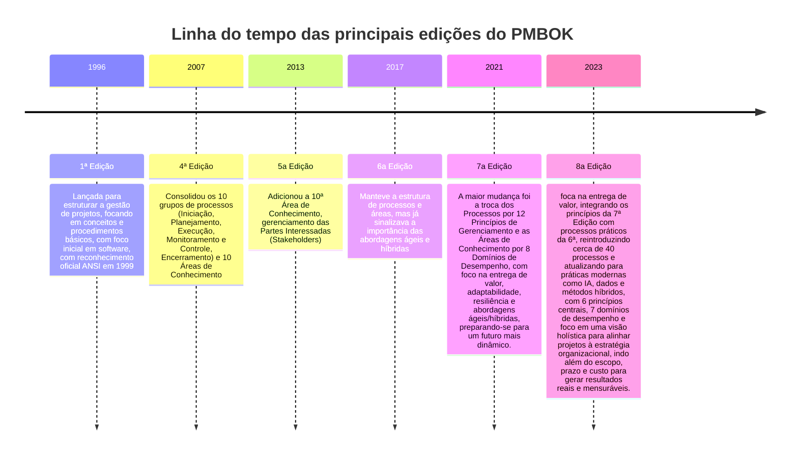

# PMBOK (Project Management Body of Knowledge) Quick Guide

Guia de melhores práticas, conceitos, processos, ferramentas e técnicas padronizadas para gerenciar projetos, publicado pelo PMI (Project Management Institute), servindo como uma referência mundial para gestores de projetos de qualquer área, independentemente da metodologia (Cascata, Híbrida, Ágil). 

<!-- ======================================
     Sessão com a linha do tempo das
     principais edições do PMBOK
=========================================== -->
---

----
|Característica|PMBOK 6|PMBOK 7|PMBOK 8|
|:--|:--|:--|:--|
|**Abordagem Principal**|Prescritiva: "Como fazer" (Processos)|Baseada em Princípios: "Por que fazer" (Mentalidade)|Integradora: Equilíbrio entre Mindset (Por que) e Execução (Como)|
|**Estrutura Central**|Áreas de Conhecimento|12 Princípios e 8 Domínios de Desempenho|6 Princípios Consolidados e 7 Domínios de Desempenho|
|**Organização do Trabalho**|5 Grupos de Processos|Foco em Entrega de Valor e Sistema de Entrega|Reintroduz Grupos de Processos como "Áreas de Foco"|
|**Processos e ITTOs** (**I**nput, **T**ools, **T**echniques, **O**utputs)|49 processos detalhados com Entradas, Ferramentas e Saídas|Removidos do guia físico (migrados para o PMIstandards+)|Reintroduz cerca de 40 processos simplificados e orientações práticas|
|**Foco de Entrega**|Entregas do projeto (escopo/produtos)|Resultados e Valor para o negócio|Valor contínuo, Sustentabilidade e IA|
|**Papel do Gerente**|Controlador de processos e cronogramas|Facilitador|Líder estratégico, facilitador de IA e agente de valor|
|**Temas Emergentes**|Menção tímida ao Ágil|Foco total em Híbrido e Ágil|IA Generativa, Governança de Dados e Sustentabilidade (ESG)|
---

#### PMBOK 6: 10 áreas de conhecimento

|Área de   Conhecimento|Descrição|
|:--|:--|
|**1. Integração**|Processos que identificam, definem e coordenam todas as outras áreas. Nessa área de conhecimento que se cria o Termo de Abertura e o Plano de Gerenciamento.|
|**2. Escopo**|Garante que o projeto inclua todo o trabalho necessário, e apenas o trabalho necessário. Foca em definir o que entra e o que fica de fora (evitando o "escopo não planejado").|
|**3. Conograma**|Planejamento das atividades, sequenciamento, estimativa de durações e o controle do calendário para garantir a entrega no prazo.|
|**4. Custo**|Planejamento, estimativa, orçamento e controle dos custos para que o projeto seja concluído dentro do orçamento aprovado.|
|**5. Qualidade**|Garante que o projeto satisfaça as necessidades pelas quais foi empreendido, seguindo padrões e requisitos estabelecidos.|
|**6. Recursos**|Identificação, aquisição e gestão dos recursos necessários (tanto pessoas/equipe quanto materiais, equipamentos e infraestrutura).|
|**7. Comunicação**|Garantir que as informações do projeto sejam coletadas, distribuídas e armazenadas de forma eficaz e no tempo certo para as pessoas certas.|
|**8. Risco**|Identificar, analisar e planejar respostas para incertezas (eventos positivos ou negativos) que podem afetar o projeto.|
|**9. Aquisição**|Comprar ou adquirir produtos, serviços ou resultados externos à equipe do projeto.|
|**10. StakeHolders**|Identificar as pessoas ou organizações que podem afetar ou ser afetadas pelo projeto, visando gerenciar suas expectativas e engajamento.|

#### PMBOK 6: Grupo de Processos
| Grupo de Processos | Descrição |
| :--- | :--- |
| **Grupo 1:** Iniciação | Desenvolver e aprovar o Termo de Abertura do Projeto (Project Charter), com seus respectivos stakeholders e obtém a autorização formal para iniciar o projeto ou fase do projeto. |
| **Grupo 2:** Planejamento | Criar a EAP (Estrutura Analítica do Projeto), definir o cronograma, orçamento, plano de riscos e de comunicação. |
| **Grupo 3:** Execução | Gerenciar a equipe, realizar a garantia da qualidade e distribuir informações, coordenando pessoas e recursos para produzir as entregas (deliverables) do projeto. |
| **Grupo 4:** Monitoramento e Controle | Rastrear, revisar e regular o progresso e o desempenho do projeto, controlando as mudanças, riscos e análise der variância do planejado versus realizado. |
| **Grupo 5:** Encerramento | Obter a aceitação formal do cliente, arquivar documentos, liberar a equipe e registrar as lições aprendidas. |

#### PMBOK 6: Processos por grupo de processo

| **Grupo 1: Iniciação** | **Desenvolver e aprovar o Termo de Abertura do Projeto (Project Charter), com seus respectivos stakeholders e obtém a autorização formal para iniciar o projeto ou fase do projeto.** |
| :--- | :--- |
| Processo 1. Desenvolver o Termo de Abertura do Projeto | Documento que autoriza formalmente a existência do projeto e dá autoridade ao gerente. |
| Processo 2. Identificar as Partes Interessadas | Identifica pessoas e grupos impactados e documenta seus interesses e influência. |

| **Grupo 2: Planejamento** | **Criar a EAP (Estrutura Analítica do Projeto), definir o cronograma, orçamento, plano de riscos e de comunicação.** |
| :--- | :--- |
| Processo 3. Desenvolver o Plano de Gerenciamento do Projeto | Define como o projeto será executado, monitorado e controlado. |
| Processo 4. Planejar o Gerenciamento do Escopo | Cria o plano que define como o escopo será definido e validado. |
| Processo 5. Coletar os Requisitos | Determina e documenta as necessidades das partes interessadas. |
| Processo 6. Definir o Escopo | Desenvolve uma descrição detalhada do projeto e do produto. |
| Processo 7. Criar a EAP (Estrutura Analítica do Projeto) | Decompõe o trabalho do projeto em componentes menores e manejáveis. |
| Processo 8. Planejar o Gerenciamento do Cronograma | Estabelece políticas e procedimentos para o planejamento do tempo. |
| Processo 9. Definir as Atividades | Identifica as ações específicas para produzir as entregas do projeto. |
| Processo 10. Sequenciar as Atividades | Identifica e documenta as relações de dependência entre as atividades. |
| Processo 11. Estimar as Durações das Atividades | Estima o número de períodos de trabalho necessários para cada tarefa. |
| Processo 12. Desenvolver o Cronograma | Analisa sequências, durações e recursos para criar o modelo do cronograma. |
| Processo 13. Planejar o Gerenciamento dos Custos | Define como os custos serão estimados, orçados e controlados. |
| Processo 14. Estimar os Custos | Desenvolve uma estimativa dos recursos monetários necessários. |
| Processo 15. Determinar o Orçamento | Agrega os custos estimados para estabelecer uma linha de base autorizada. |
| Processo 16. Planejar o Gerenciamento da Qualidade | Identifica os requisitos e padrões de qualidade para o projeto. |
| Processo 17. Planejar o Gerenciamento de Recursos | Define como estimar, adquirir e gerenciar recursos físicos e de equipe. |
| Processo 18. Estimar os Recursos das Atividades | Estima o tipo e as quantidades de materiais, pessoas e equipamentos. |
| Processo 19. Planejar o Gerenciamento das Comunicações | Desenvolve uma abordagem para comunicações eficazes com os stakeholders. |
| Processo 20. Planejar o Gerenciamento dos Riscos | Define como conduzir as atividades de gerenciamento de riscos. |
| Processo 21. Identificar os Riscos | Determina quais riscos podem afetar o projeto e suas características. |
| Processo 22. Realizar a Análise Qualitativa dos Riscos | Prioriza riscos avaliando sua probabilidade e impacto. |
| Processo 23. Realizar a Análise Quantitativa dos Riscos | Analisa numericamente o efeito dos riscos identificados no projeto. |
| Processo 24. Planejar as Respostas aos Riscos | Desenvolve opções e ações para aumentar oportunidades e reduzir ameaças. |
| Processo 25. Planejar as Aquisições | Documenta as decisões de compras e identifica fornecedores potenciais. |
| Processo 26. Planejar o Engajamento das Partes Interessadas | Desenvolve estratégias para envolver as partes interessadas de forma eficaz. |

| **Grupo 3: Execução** | **Gerenciar a equipe, realizar a garantia da qualidade e distribuir informações, coordenando pessoas e recursos para produzir as entregas (deliverables) do projeto.** |
| :--- | :--- |
| Processo 27. Orientar e Gerenciar o Trabalho do Projeto | Lidera a execução das atividades definidas no plano. |
| Processo 28. Gerenciar o Conhecimento do Projeto | Usa conhecimentos existentes e cria novos para alcançar os objetivos. |
| Processo 29. Gerenciar a Qualidade | Traduz o plano de qualidade em atividades executáveis. |
| Processo 30. Adquirir Recursos | Obtém membros da equipe, instalações, equipamentos e materiais. |
| Processo 31. Desenvolver a Equipe | Melhora competências e a interação dos membros da equipe. |
| Processo 32. Gerenciar a Equipe | Acompanha o desempenho, fornece feedback e resolve problemas. |
| Processo 33. Gerenciar as Comunicações | Garante a coleta, distribuição e armazenamento das informações. |
| Processo 34. Implementar Respostas aos Riscos | Executa os planos acordados de resposta aos riscos. |
| Processo 35. Conduzir as Aquisições | Obtém respostas de fornecedores, seleciona e assina contratos. |
| Processo 36. Gerenciar o Engajamento das Partes Interessadas | Comunica-se e trabalha com stakeholders para atender suas necessidades. |

| **Grupo 4: Monitoramento e Controle** | **Rastrear, revisar e regular o progresso e o desempenho do projeto, controlando as mudanças, riscos e análise de variância do planejado versus realizado.** |
| :--- | :--- |
| Processo 37. Monitorar e Controlar o Trabalho do Projeto | Acompanha e revisa o progresso para atender aos objetivos de desempenho. |
| Processo 38. Realizar o Controle Integrado de Mudanças | Analisa solicitações de mudança e aprova ou rejeita as mesmas. |
| Processo 39. Validar o Escopo | Formaliza a aceitação das entregas concluídas do projeto. |
| Processo 40. Controlar o Escopo | Monitora o status do escopo e gerencia mudanças na linha de base. |
| Processo 41. Controlar o Cronograma | Monitora o status das atividades para atualizar o progresso. |
| Processo 42. Controlar os Custos | Monitora o status do projeto para atualizar o orçamento. |
| Processo 43. Controlar a Qualidade | Monitora resultados da execução para garantir que as saídas estão corretas. |
| Processo 44. Controlar os Recursos | Garante que os recursos físicos atribuídos estão disponíveis conforme planejado. |
| Processo 45. Monitorar as Comunicações | Garante que as necessidades de informação das partes interessadas sejam atendidas. |
| Processo 46. Monitorar os Riscos | Acompanha riscos identificados e identifica novos riscos. |
| Processo 47. Controlar as Aquisições | Gerencia relações de aquisição e monitora o desempenho dos contratos. |
| Processo 48. Monitorar o Engajamento das Partes Interessadas | Monitora relacionamentos e ajusta estratégias de engajamento. |

| **Grupo 5: Encerramento** | **Obter a aceitação formal do cliente, arquivar documentos, liberar a equipe e registrar as lições aprendidas.** |
| :--- | :--- |
| Processo 49. Encerrar o Projeto ou Fase | Finaliza todas as atividades para fechar formalmente o projeto ou fase. |

---
#### PMBOK 7 x PMBOK 6

 <a href="https://www.careersprints.com/post/key-differences-between-pmbok-7-vs-pmbok-6-a-thorough-guide#:~:text=PMBOK%20Guide%207%20vs%206,Guide%206th%20vs%207th%20edition.">Key Differences Between PMBOK 7 vs PMBOK 6</a>

Artigos:
- [Key Differences Between PMBOK 7 vs PMBOK 6](https://www.careersprints.com/post/key-differences-between-pmbok-7-vs-pmbok-6-a-thorough-guide#:~:text=PMBOK%20Guide%207%20vs%206,Guide%206th%20vs%207th%20edition.)

