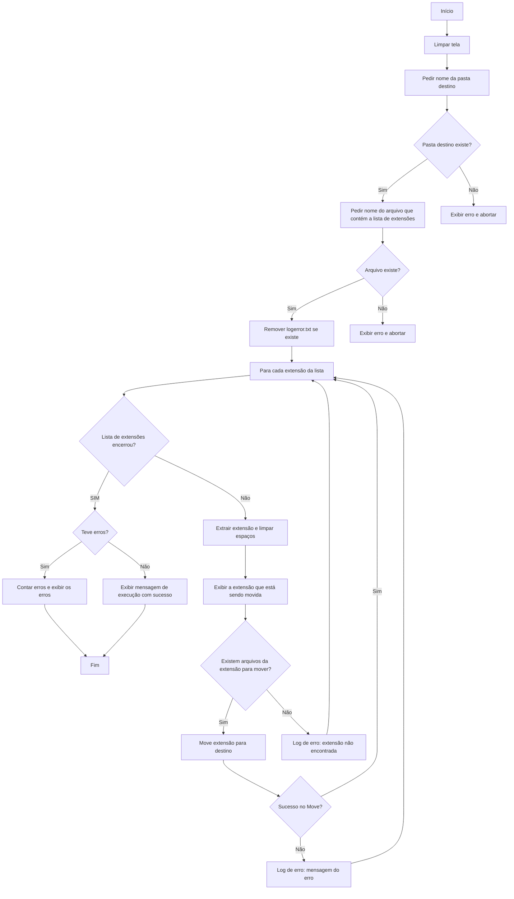

# Windows PowerShell Quick Guide
---

**Opção 1. Mover arquivos**
>**Comando**
>```Move-Item -Path "C:\Origem\arquivo.txt" -Destination "C:\Destino\"```

**Opção 2. Copiar arquivos**
>**Comando**
>```Copy-Item -Path "Origem" -Destination "Destino"```

**Opção 3. Gerar uma lista com valores únicos da extensão dos arquivos**
>**Comando**
>```clear; $out = Read-Host "Informe o nome do arquivo para salvar a lista (ou deixe vazio para exibir na tela)"; $dados = Get-ChildItem -File | Group-Object Extension | Sort-Object Name | ForEach-Object { [PSCustomObject]@{ Extensao = $_.Name.TrimStart('.'); Quantidade = $_.Count } }; if ($out) { $dados | Export-Csv -Path $out -NoTypeInformation -Delimiter ',' -Encoding utf8; Write-Host "`nRelatorio salvo em: $out" -ForegroundColor Green } else { $dados | Format-Table -AutoSize }; $total = ($dados | Measure-Object -Property Quantidade -Sum).Sum; Write-Host "`nTotal de arquivos listados: $total" -ForegroundColor Cyan;Read-Host "Pressione qualquer tecla para prosseguir..."```
>> Esse comando não irá simplesmente listar as extensões únicas dos arquivos da pasta.
>> A sequência será:
>>>**1.** solicitar o nome do arquivo onde se deseja salvar a listagem
>>>**2.** listar todos os arquivos na pasta onde o comando foi executado
>>>**3.** extrair a extensão de cada arquivo
>>>**4.** ordenar em ordem crescente a lista das extensões
>>>**5.** para cada extensão, irá retirar o "." no início do nome da extensão
>>>**6.** para cada extensão, irá contar quantos arquivos existem referentes àquela extensão
>>>**7.** no final da execução será exibida a quantidade de arquivos listados
>>>> Se o nome do arquivo não for informado, a listagem será exibida na tela

**Opção 4. Deletar uma pasta com suas subpastas e arquivos**
>**Comando**
>```clear;$fold = Read-Host "Digite o nome da pasta que se deseja deletar [Ctrl-c poara abortar]"; if (-not (Test-Path $fold)) { Write-Host "ERRO: A pasta '$fold' nao existe. Processamento abortado." -ForegroundColor Red; break };Remove-Item -Path $fold -Recurse -Force -ErrorAction Stop```

**Opção 5. Obter informações de uso dos discos**
>**Comando**
>```clear; $out = Read-Host "Informe o nome do arquivo onde salvar as informacoes (ou deixe vazio para exibir na tela)"; $meusDiscos = Get-Volume | Where-Object DriveLetter | ForEach-Object { $totalGB = [Math]::Round($_.Size / 1GB, 2); $livreGB = [Math]::Round($_.SizeRemaining / 1GB, 2); $perc = [Math]::Round((($_.Size - $_.SizeRemaining) / $_.Size) * 100, 2); $msg = if ($perc -gt 80) { "Attention!! Occupation > 80%" } else { "OK" }; [PSCustomObject]@{ Drive = $_.DriveLetter; FileSystem = $_.FileSystemType; 'Total(GB)' = "$($totalGB)GB"; 'Livre(GB)' = "$($livreGB)GB"; 'Uso%' = "$perc%"; Msg = $msg } }; if ($out) { $meusDiscos | Export-Csv -Path $out -NoTypeInformation -Delimiter ',' -Encoding utf8; Write-Host "`nRelatorio salvo em: $out" -ForegroundColor Green; Write-Host "Conteudo do arquivo salvo:`n"; Import-Csv $out | Format-Table -AutoSize } else { $meusDiscos | Format-Table -AutoSize }```
>> Esse comando irá listar todos os drives de um computador Windows trazendo as seguintes informações para cada drive:
>>> Letra do drive
>>> FileSystem
>>> Tamanho total do disco em GB
>>> A quantidade usada em GB
>>> O percentual de uso
>>> Mensagem de alerta caso o percentual esteja acima de 80%

**Opção 6. Listando em formato de tabela, o conteúdo de arquivo texto separado por vírgula**
>**Comando**
>```clear;$file = Read-Host "Informe o nome do arquivo com as informacoes (ou Ctrol-c para abortar o processamento)"; if (-not (Test-Path $file)) { Write-Host "ERRO: o arquivo  '$file' nao existe. Processamento abortado." -ForegroundColor Red; break }; Write-Host "=====================" -ForegroundColor Green;Write-Host "Exibindo as informacoes de '$file'" -ForegroundColor Green; Write-Host "=====================" -ForegroundColor Green; Import-Csv $file | Format-Table -AutoSize```

**Opção 7. Movendo arquivos com extensões listadas**
>**Comando**
>```clear; $dest = Read-Host "Digite o nome da pasta de destino [Ctrl-c para abortar]"; if (-not (Test-Path $dest)) { Write-Host "ERRO: O destino '$dest' nao existe. Processamento abortado." -ForegroundColor Red; break }; $extlist = Read-Host "Digite o nome do arquivo da lista das extensoes [Ctrl-c para abortar]"; if (-not (Test-Path $extlist)) { Write-Host "ERRO: o arquivo '$extlist' nao existe. Processamento abortado." -ForegroundColor Red; break }; if (Test-Path "logerror.txt") { Remove-Item "logerror.txt" }; Import-Csv -Path $extlist | ForEach-Object { $ext = $_.Extensao.Trim(); if ($ext) { Write-Host "Movendo arquivos: $ext" -ForegroundColor Yellow; try { if (-not (Test-Path "*.$ext")) { throw "extensão não encontrada" }; Move-Item -Path "*.$ext" -Destination $dest -ErrorAction Stop } catch { "[$ext] ERROR: $($_.Exception.Message)" | Out-File "logerror.txt" -Append } } }; if (Test-Path "logerror.txt") { $erros = (Get-Content "logerror.txt").Count; Write-Host "`nErros encontrados: $erros" -ForegroundColor Red; Get-Content "logerror.txt" } else { Write-Host "`nExecucao realizada com sucesso em '$dest'! Nenhum erro registrado." -ForegroundColor Green }```
>
>**Diagrama do comando**

