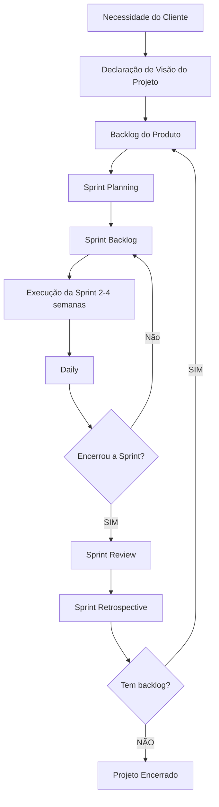

# SCRUM

> **Definição:** Framework para gerenciamento de projetos

---
> **Componentes do SCRUM**

| Pilares | Papéis | Eventos | Artefatos |
| :-- | :-- | :-- | :-- |
| 1. Transparência | 1. Scrum Master | 1. Sprint Planning | 1. Product Backlog |
| 2. Inspeção | 2. Product Owner | 2. Sprint Execution | 2. Sprint Backlog |
| 3. Adaptação | 3. Scrum Team | 3. Daily | 3. Product Increment |
| | | 4. Sprint Review | |
| | | 5. Sprint Retrospective | |

---
> **Visão geral do fluxo do SCRUM**

---
> **Backlog do Produto:**
>1. Lista ordenada e dinâmica de tudo que é necessário para a entrega do produto
>2. Contém as funcionalidades, requisitos (história do usuário), melhorias, correções
>3. É gerenciada pelo Product Owner (PO)
>4. É a fonte para o *Sprint Planning*
>5. Os items a serem desenvolvidos são priorizados com os mais importantes e valiosos no topo e que serão os primeiros a serem trabalhados
>6. Evolui com as reuniões de *Sprint Review* e *Sprint Retrospective*

---
>**Sprint Planning:** Reunião para definir o objetivo (porquê), priorizar e selecionar os itens do Product Backlog (o quê será entregue), criar o plano de implementação (como)
>>Participam da Sprint Planning o Product Owner, SCRUM Master, scrum Team envolvido e outros interessados normalmente convidados pelo PO quando e se necessário
>> A Sprint Planning é que gera o Sprint Backlog que são os itens que serão implementados na sprint

---
> **Daily:** Uma breve reunião diária de 15 minutos com o *SCRUM Team* com o objetivo de sincronizar, inspecionar o progresso em direção à meta da Sprint e adaptar o backlog da Sprint para criar um plano de ação para o dia seguinte, melhorando a comunicação, a tomada de decisões e a autogestão.

        Devem ser respondidas pelo menos 3 questões:
            1. O que foi realizado ontem?
            2. O que será realizado hoje?
            3. Existe algum issue ou impedimento?

---
> **Sprint Review:** reunião realizada ao final da sprint para inspecionar o incremento

| A reunião |  Participantes | Quando e duração |
| :-- | :-- | :-- |
|**Incremento:** mostra o que foi entregue e o que será entregue| **Toda equipe SCRUM:** Scrum Master, PO, Scrum Team|Ocorre ao final de cada Sprint|
|**Feedback:** feedback dos stakeholders e PO|**Interessados:** convidados pelo PO|Duração média de 4 horas|
|**Backlog:** atualização do backlog com base nos feedbacks|

---
> **Sprint Retrospective:** reunião realizada ao final da sprint com objetivo de analisar como foi realizada a sprint. identificando o que funcionou, o que não funcionou e o que pode ser melhorado, criando um plano de ação concreto para o próximo Sprint, focando na melhoria contínua

---
>**SCRUM Master x Product Owner**

|SCRUM Master|Product Owner|
|:--|:--|
|1. Atuar como o guardião do SCRUM, garantindo que sejam seguidos os princípios e práticas do SCRUM|1. Maximizar o valor do produto|
|2. Garantir que as Dailys, Sprint Planning, Sprint Review e Sprint Retrospective aconteçam e seja produtivas|2. Ser a voz do cliente e partes interessadas junto à equipe SCRUM|
|3. Identificar e resolver problemas que impeçam o progresso da sprint, garantindo e mantendo o foco no objetivo|3. Gerenciar o Product Log: criar, detalhar, refinar e priorizar o que deverá ser entregue prioritariamente com objetivo de entregar maior valor|
|4. Orientar a todos envolvidos no projeto sobre SCRUM, valores e métodos ágeis, autogestão, melhoria contínua, processos e fluxos|4. Garantir à equipe SCRUM e partes interessadas do cliente o entendimento claro do que será construído, metas e visão do produto|
|5. Facilitar a comunicação entre todos os envolvidos no projeto: SCRUM Team, PO, stakeholders. usuários, ...|5. Avaliar e aceitar/rejeitar as entregas nas Sprint Review|

---
>**História do usuário:** descrição de uma funcionalidade sob a perspectiva do usuário cobrindo "quem", "o quê" e "porquê"

|Estrutura da história|Exemplo|
|:--|:--|
|*Como [usuário], quero [funcionalidade], para que [valor]*|***Como** cliente, eu **quero** poder pesquisar produtos por preço, **para que** eu possa encontrar facilmente opções que caibam no meu orçamento*|